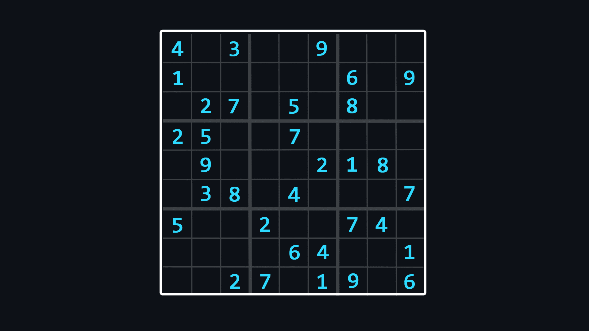
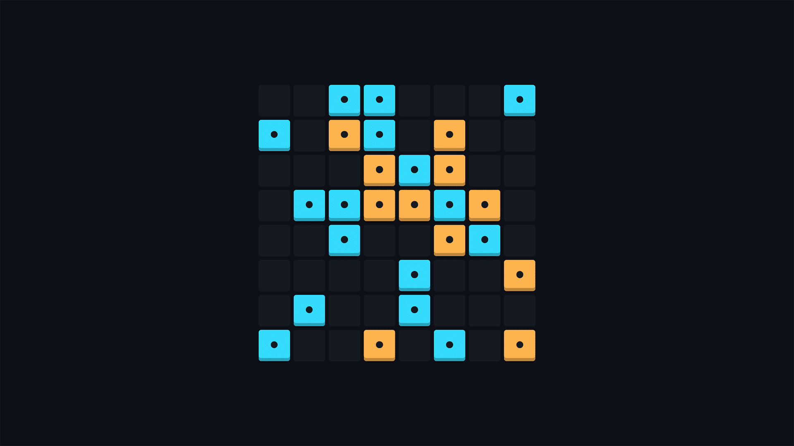
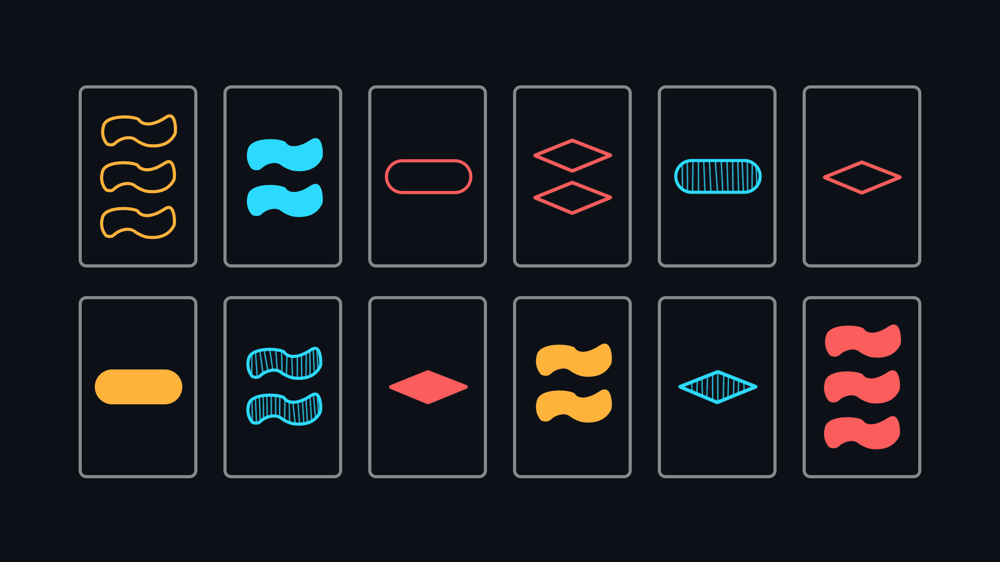
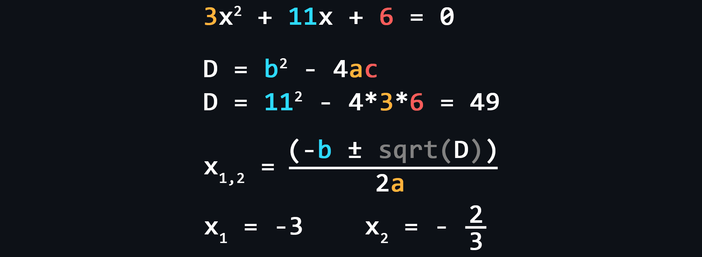
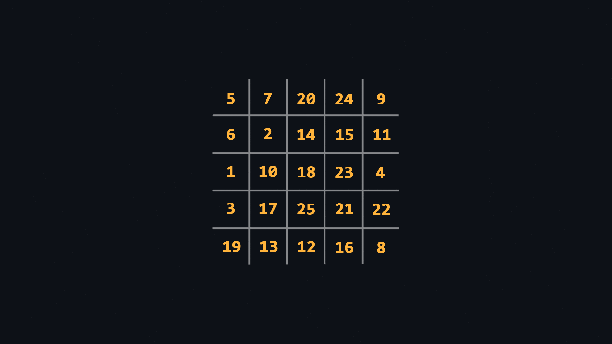

<a href="https://goreportcard.com/report/github.com/cheatsnake/shadify"></a>
<a href="https://github.com/cheatsnake/shadify/releases"></a>
<a href="https://img.shields.io/github/repo-size/cheatsnake/shadify?color=blue"></a>
<a href="https://img.shields.io/github/license/cheatsnake/shadify?color=orange"></a>
<a href="https://github.com/cheatsnake/shadify/issues"></a>

# Shadify

Сосредоточьтесь на создании невероятных и красивых приложений не беспокоясь о сложной логике.

## Быстрый обзор

Shadify – это мощный сервис генерации данных и выполнения различной логики на стороне сервера для создания разного рода приложений и игр. Для взаимодействия с сервисом используются HTTP-запросы, которые возвращают удобные ответы в формате JSON. Shadify может быть очень полезен разработчикам, которые занимаются Frontend-разработкой. Благодаря уже имеющимся модулям, Вы можете полностью сосредоточиться на создании красивых UI для приложений, которые обогатят ваше портфолио.

Кодовая база написана на языке программирования Go, который великолепно подходит для создания серверных приложений, а так же обеспечивает высокую вычислительную мощность.

## Документация

Сервис разделен на независимые модули. Каждый модуль начинается с краткого описания того, на что ориентирован данный модуль (будь-то игра, головоломка, задача и т.д.) . Далее идет подробное описание каждого HTTP-эндпоинта с описанием возможных параметров и возвращаемых ответов.

-   [Sudoku](#sudoku)
-   [Takuzu](#takuzu)
-   [Set](#set)
-   [Math](#math)
-   [Schulte](#schulte)
-   [Minesweeper](#minesweeper)
-   [Wordsearch](#wordsearch)
-   [Anagram](#anagram)
-	[Countries](#countries)
-	[Camp](#camp)
-	[Kuromasu](#kuromasu)

### Sudoku

<p align="center"></p>

[Судоку](https://ru.wikipedia.org/wiki/%D0%A1%D1%83%D0%B4%D0%BE%D0%BA%D1%83) – популярная головоломка с числами. Суть игры заключается в заполнении свободных клеток цифрами от 1 до 9 так, чтобы в каждой строке, в каждом столбце и в каждом малом квадрате 3×3 каждая цифра встречалась бы только один раз.

-   Генерация случайного судоку

```rust
GET https://shadify.dev/api/sudoku/generator
```

| Параметр | Описание                                                                                                                                      |
| -------- | --------------------------------------------------------------------------------------------------------------------------------------------- |
| `fill`   | _Опциональный_ <br> Число от 0 до 100, которое соответствует уровню заливки поля (в процентном соотношении). <br> Значение по умолчанию – 30. |

Возвращаемый ответ:

```json
{
    "grid": [
        [9, 8, 7, 3, 2, 1, 5, 6, 4],
        [6, 5, 4, 9, 8, 7, 2, 3, 1],
        [3, 2, 1, 6, 5, 4, 8, 9, 7],
        [7, 6, 5, 1, 9, 8, 3, 4, 2],
        [1, 9, 8, 4, 3, 2, 6, 7, 5],
        [4, 3, 2, 7, 6, 5, 9, 1, 8],
        [8, 7, 6, 2, 1, 9, 4, 5, 3],
        [5, 4, 3, 8, 7, 6, 1, 2, 9],
        [2, 1, 9, 5, 4, 3, 7, 8, 6]
    ],
    "task": [
        [0, 8, 7, 0, 0, 0, 0, 0, 4],
        [0, 0, 0, 9, 0, 0, 2, 0, 0],
        [0, 2, 1, 6, 5, 4, 0, 0, 7],
        [0, 0, 0, 1, 0, 8, 0, 4, 2],
        [0, 9, 8, 4, 3, 0, 0, 0, 0],
        [4, 0, 2, 0, 0, 0, 0, 0, 0],
        [8, 0, 6, 2, 0, 0, 0, 0, 0],
        [5, 0, 3, 0, 0, 6, 0, 2, 9],
        [0, 0, 0, 0, 4, 0, 0, 0, 0]
    ]
}
```

> - `grid` - полностью решённый судоку. <br> 
> - `task` - задание, которое необходимо решить заполнив нулевые значения правильными цифрами.

-   Проверка судоку

Для проверки судоку можно использовать GET-запрос с обязательным query-параметром

```rust
GET https://shadify.dev/api/sudoku/verifier
```

| Параметр | Описание                                                                                                                         |
| -------- | -------------------------------------------------------------------------------------------------------------------------------- |
| `task`   | _Обязательный_ <br> Строка вида `123-123-123`, которая соответствует полю судоку, где каждая строка (row) разделена знаком тире. |

Пример GET-запроса:

```rust
https://shadify.dev/api/sudoku/verifier?task=123564897-456897231-789231564-234675918-567918342-891342675-345786129-678129453-912453786
```

Так же, для удобства, можно использовать POST-запрос с body в формате JSON

```rust
POST https://shadify.dev/api/sudoku/verifier
```

Пример body для POST-запроса:

```json
{
    "task": [
        [9, 6, 3, 2, 8, 5, 7, 4, 1],
        [8, 5, 2, 1, 7, 4, 6, 3, 9],
        [1, 7, 4, 3, 9, 6, 8, 5, 2],
        [6, 3, 9, 8, 5, 2, 3, 1, 7],
        [5, 2, 8, 7, 4, 1, 3, 9, 6],
        [7, 4, 1, 9, 6, 3, 5, 2, 8],
        [4, 1, 7, 6, 3, 9, 2, 8, 5],
        [3, 9, 6, 5, 2, 8, 1, 7, 4],
        [2, 8, 5, 4, 1, 7, 9, 6, 3]
    ]
}
```

Возвращаемый ответ:

```json
{
    "isError": true,
    "position": "row-4"
}
```

### Takuzu

<p align="center"></p>

[Takuzu](https://en.wikipedia.org/wiki/Takuzu) (так же известная как Binairo) – занимательная головоломка с простыми правилами. Всё, что Вам нужно сделать, это заполнить квадратное поле определенного размера плитками двух цифр (или цветов), придерживаясь при этом трёх простых правил:

1. Каждый столбец и каждая строка должны быть уникальны между собой
2. В каждой строке и каждом столбце должно быть равное количество плиток каждой цифры
3. Нельзя ставить более двух плиток с одной и той же цифрой подряд (110001 – неправильно, 110010 – правильно).

Для примера, можете посмотреть [мою реализацию](https://binario.vercel.app) этой головоломки.

-   Генерация Takuzu

```rust
GET https://shadify.dev/api/takuzu/generator
```

| Параметр | Описание                                                                                                                                      |
| -------- | --------------------------------------------------------------------------------------------------------------------------------------------- |
| `size`   | _Опциональный_ <br> Чётное число от 4 до 12, которое задает размерность поля. <br> Значение по умолчанию – 8.                                 |
| `fill`   | _Опциональный_ <br> Число от 0 до 100, которое соответствует уровню заливки поля (в процентном соотношении). <br> Значение по умолчанию – 33. |

Возвращаемый ответ:

```json
{
    "size": 8,
    "field": [
        ["1", "1", "0", "0", "1", "1", "0", "0"],
        ["1", "1", "0", "1", "0", "0", "1", "0"],
        ["0", "0", "1", "0", "1", "1", "0", "1"],
        ["0", "1", "1", "0", "0", "1", "1", "0"],
        ["1", "0", "0", "1", "1", "0", "0", "1"],
        ["0", "0", "1", "1", "0", "0", "1", "1"],
        ["0", "1", "1", "0", "1", "1", "0", "0"],
        ["1", "0", "0", "1", "0", "0", "1", "1"]
    ],
    "task": [
        ["1", "1", "0", "0", "x", "x", "0", "0"],
        ["x", "1", "0", "x", "0", "x", "x", "x"],
        ["x", "x", "1", "x", "x", "x", "x", "x"],
        ["x", "1", "1", "x", "x", "x", "1", "0"],
        ["x", "x", "x", "x", "x", "x", "x", "1"],
        ["0", "x", "x", "x", "x", "x", "x", "1"],
        ["x", "x", "x", "x", "x", "1", "0", "x"],
        ["x", "x", "x", "x", "x", "x", "1", "1"]
    ]
}
```

-   Проверка Takuzu

Для проверки Takuzu можно использовать GET-запрос с обязательным query-параметром

```rust
GET https://shadify.dev/api/takuzu/verifier
```

| Параметр | Описание                                                                                                                                                                                                                                        |
| -------- | ----------------------------------------------------------------------------------------------------------------------------------------------------------------------------------------------------------------------------------------------- |
| `task`   | _Обязательный_ <br> Строка вида `1010-1100-0011-0101`, которая соответствует полю Takuzu, где каждая строка (row) разделена знаком тире. Может содержать только 0 и 1, количество строк должно быть равно количеству элементов в каждой строке. |

Пример GET-запроса:

```rust
https://shadify.dev/api/takuzu/verifier?task=1010-1100-0101-0101
```

Так же, для удобства, можно использовать POST-запрос с body в формате JSON

```rust
POST https://shadify.dev/api/takuzu/verifier
```

Пример body для POST-запроса:

```json
{
    "task": [
        ["1", "0", "1", "0"],
        ["1", "1", "0", "0"],
        ["0", "0", "1", "1"],
        ["0", "1", "0", "1"]
    ]
}
```

Возвращаемый ответ:

```json
{
    "isError": true,
    "message": "duplication",
    "position": ["row-3", "row-4"]
}
```

### Set

<p align="center"></p>

[Сет (игра)](<https://ru.wikipedia.org/wiki/%D0%A1%D0%B5%D1%82_(%D0%B8%D0%B3%D1%80%D0%B0)>) – увлекательная карточная игра. Колода для игры состоит из 81 карты, на каждой из которых изображены один, два или три одинаковых символа (ромба, овала или волны) одного и того же цвета (красного, зелёного или фиолетового) и одной и той же текстуры (закрашенные, заштрихованные или только контур). Суть игры заключается в поиске сета – набора из трёх карт, который соответствует определенным условиям.

Для понимания правил почитайте Википедию или посмотрите [это интересное видео](https://youtu.be/G3EFG56nEp4).

-   Получение всех карт

```rust
GET https://shadify.dev/api/set/start
```

Всегда возвращает одинаковый массив состоящий из 81 объекта. Каждый объект соответствует одной из карт. Пример карты:

```json
{
    "_id": 0,
    "number": 1,
    "shape": "diamond",
    "color": "red",
    "shading": "solid"
}
```

> - `_id` - уникальный идентификатор каждой карты <br> 
> - `number` – количество фигур: _1_ / _2_ / _3_ <br> 
> - `shape` – форма фигуры: _diamond_ / _squiggle_ / _oval_ <br> 
> - `color` – цвет фигуры: _red_ / _green_ / _purple_ <br> 
> - `shading` – заливка фигуры: _solid_ / _striped_ / _open_

-   Генерация новой партии

```rust
GET https://shadify.dev/api/set/start
```

| Параметр       | Описание                                                                                                                                                                                                                                                                                         |
| -------------- | ------------------------------------------------------------------------------------------------------------------------------------------------------------------------------------------------------------------------------------------------------------------------------------------------ |
| `possibleSets` | _Опциональный_ <br> Строка true/false, которая включает/выключает поиск возможных сетов в текущем `layout`. Список возможных сетов не обязателен для игры и выступает лишь в качестве подсказок и доказательств того, что в текущем `layout` существуют сеты. <br> Значение по умолчанию – true. |

Возвращаемый ответ:

```json
{
	"freeCards": [<69 карт>],
	"layout": [<12 карт>],
	"possibleSets": [[<3 карты>]],
	"wonCards": [],
	"state": "20-4-11-10-12-46-70-62-41-23-3-8"
}
```

> - `freeCards` – массив объектов соответствующий свободным картам, которые в игре ещё не использовались. <br> 
> - `layout` – массив объектов соответствующий картам, которые доступны для игры, т.е. для поиска сетов. <br> 
> - `possibleSets` – массив содержащий массивы, которые включают в себя ровно по 3 объекта. Каждые 3 объекта соответствуют комбинации из трёх карт образующий сет, которую возможно собрать из карт доступных на текущем `layout`. <br> 
> - `wonCards` – массив объектов соответствующий выигранным картам, которые в игре участвовать больше не будут. <br> 
> - `state` – уникальный идентификатор для текущего состояния игры. Необходим для выполнения действий по удалению сетов, добавлению дополнительных карт или просто для загрузки текущего состояния игры. Имеет вид _1-2-3@4-5-6_, где числа слева от знака _@_ соответствуют уникальным идентификаторам тех карт, которые находятся в `layout`, а числа справа – в `wonCards`.

-   Загрузка состояния

```rust
GET https://shadify.dev/api/set/<:state>
```

| Параметр       | Описание                                                                                                                                                                                                                                                                                                                                                                                                                                                                                   |
| -------------- | ------------------------------------------------------------------------------------------------------------------------------------------------------------------------------------------------------------------------------------------------------------------------------------------------------------------------------------------------------------------------------------------------------------------------------------------------------------------------------------------ |
| `possibleSets` | _Опциональный_ <br> Строка _true_/_false_, которая включает/выключает поиск возможных сетов в текущем `layout`. <br> Значение по умолчанию – _true_.                                                                                                                                                                                                                                                                                                                                       |
| `action`       | _Опциональный_ <br> Строка _add_/_remove_, которая позволяет производить соответствующее действие с текущим состоянием игры. <br> Строка _add_ добавляет в текущий `layout` 3 случайных карты из текущего массива `freeCards` (доступно только если размер `layout` не превышает 20 карт). <br> Строка _remove_ удаляет из текущего `layout` указанную комбинацию из трёх карт образующих сет. Для этого необходимо использовать параметр `cards`. <br> Значение по умолчанию отсутствует. |
| `cards`        | _Обязательный при `action=remove`_ <br> Строка вида _1-2-3_, где каждое число соответствует уникальному идентификатору одной из карт образующих сет. <br> Значение по умолчанию отсутствует.                                                                                                                                                                                                                                                                                               |

Примеры запросов с загрузкой состояния:

```rust
https://shadify.dev/api/set/0-27-53-10-46-15-16-64-32-23-29-6?possibleSets=false
```

```rust
https://shadify.dev/api/set/41-47-7-53-13-46-25-36-72-60-15-80?action=add
```

```rust
https://shadify.dev/api/set/0-27-53-10-46-15-16-64-32-23-29-6?action=remove&cards=0-16-23
```

### Math

<p align="center"></p>

Модуль для генерации случайных математических выражений. Отлично подойдет для создания различных тренажёров, в которых придётся хорошенько пошевелить мозгами. Кстати, для примера можете посмотреть [моё приложение](https://cheatsnake.github.io/MindMath/).

-   Генерация выражения со сложением

```rust
GET https://shadify.dev/api/math/add
```

-   Генерация выражения с вычитанием

```rust
GET https://shadify.dev/api/math/sub
```

-   Генерация выражения с умножением

```rust
GET https://shadify.dev/api/math/mul
```

-   Генерация выражения с делением

```rust
GET https://shadify.dev/api/math/div
```

Для выше перечисленных эндпоинтов доступны следующие параметры:

| Параметр                 | Описание                                                                                                                                                                                                                                                                                                                                      |
| ------------------------ | --------------------------------------------------------------------------------------------------------------------------------------------------------------------------------------------------------------------------------------------------------------------------------------------------------------------------------------------- |
| `minFisrt`, `maxFirst`   | _Опциональный_ <br> Параметры изменяющие диапазон генерируемых чисел только для первого числа имеющегося в выражении. <br> Значение по умолчанию для `minFirst` – 1, для `maxFirst` – 99.                                                                                                                                                     |
| `minSecond`, `maxSecond` | _Опциональный_ <br> Параметры изменяющие диапазон генерируемых чисел только для второго числа имеющегося в выражении. Эти параметры не влияют на выражения с делением, поскольку второе число выбирается случайным образом из списка возможных делителей первого числа. <br> Значение по умолчанию для `minSecond` – 1, для `maxSecond` – 99. |
| `negative`               | _Опциональный_ <br> Число 0/1 которое отключает/включает возможность появления результата с отрицательным значением для выражений с вычитанием. Изначально при генерации выражения с вычитанием первое число всегда больше второго. Для изменения этого поведения используйте этот параметр. <br> Значения по умолчанию – 0.                  |

Возвращаемый ответ:

```json
{
    "first": 17,
    "second": 56,
    "operation": "+",
    "expression": "17 + 56",
    "answer": 73
}
```

-   Генерация квадратного уравнения

<p align="center"></p>

[Квадратное уравнение](https://ru.wikipedia.org/wiki/%D0%9A%D0%B2%D0%B0%D0%B4%D1%80%D0%B0%D1%82%D0%BD%D0%BE%D0%B5_%D1%83%D1%80%D0%B0%D0%B2%D0%BD%D0%B5%D0%BD%D0%B8%D0%B5) – это уравнение вида ax2 + bx + c = 0, где коэффициенты a, b и c – произвольные числа.

```rust
GET https://shadify.dev/api/math/quad
```

| Параметр       | Описание                                                                                                                            |
| -------------- | ----------------------------------------------------------------------------------------------------------------------------------- |
| `minA`, `maxA` | _Опциональный_ <br> Минимальное и максимальное значение коэффициента А. <br> Значение по умолчанию для `minA` – 1, для `maxA` – 20. |
| `minB`, `maxB` | _Опциональный_ <br> Минимальное и максимальное значение коэффициента B. <br> Значение по умолчанию для `minB` – 1, для `maxB` – 40. |
| `minC`, `maxC` | _Опциональный_ <br> Минимальное и максимальное значение коэффициента C. <br> Значение по умолчанию для `minC` – 1, для `maxC` – 20. |

Возвращаемый ответ:

```json
{
    "equation": "1x^2 + 14x + 24 = 0",
    "a": 1,
    "b": 14,
    "c": 24,
    "discriminant": 100,
    "x1": "-12.000",
    "x2": "-2.000"
}
```

### Schulte

[Таблицы Шульте](https://ru.wikipedia.org/wiki/%D0%A2%D0%B0%D0%B1%D0%BB%D0%B8%D1%86%D0%B0_%D0%A8%D1%83%D0%BB%D1%8C%D1%82%D0%B5) – таблицы со случайно расположенными объектами (обычно числами или буквами), служащие для проверки и развития быстроты нахождения этих объектов в определённом порядке (как правило в порядке возрастания для цифр и в алфавитном порядке для букв). Упражнения с таблицами позволяют улучшить периферическое зрительное восприятие, что положительно повлияет на навык скорочтения.

-   Генерация случайной таблицы

<p align="center"></p>

```rust
GET https://shadify.dev/api/schulte/generator
```

| Параметр | Описание                                                                                                                                                                                                                        |
| -------- | ------------------------------------------------------------------------------------------------------------------------------------------------------------------------------------------------------------------------------- |
| `size`   | _Опциональный_ <br> Размер генерируемой таблицы. Доступный диапазон от 1 до 15. <br> Значение по умолчанию – 5.                                                                                                                 |
| `mode`   | _Опциональный_ <br> Строка _number_ / _alphabet_, которая определяет генерируемые значения для таблицы: числа или буквы. При выборе _alphabet_ параметр `size` всегда будет равняться 5. <br> Значение по умолчанию – _number_. |

Возвращаемый ответ:

```json
{
    "grid": [
        [9, 18, 6, 1, 5],
        [11, 24, 25, 15, 19],
        [13, 7, 10, 21, 23],
        [20, 22, 12, 17, 16],
        [2, 8, 4, 14, 3]
    ]
}
```

### Minesweeper

<p align="center"></p>

[Сапёр](<https://ru.wikipedia.org/wiki/%D0%A1%D0%B0%D0%BF%D1%91%D1%80_(%D0%B8%D0%B3%D1%80%D0%B0)>) – компьютерная игра-головоломка, в которой игровое поле разделено на смежные ячейки, некоторые из которых заминированы. Количество заминированных ячеек известно. Целью игры является открытие всех ячеек, не содержащих мины. Это игра стала довольно популярной среди пользователей Windows, поскольку была предустановлена по умолчанию на более старых версиях этой ОС.

-   Генерация случайного поля

```rust
GET https://shadify.dev/api/minesweeper/generator
```

| Параметр | Описание                                                                                                                                                                                                                                                                                                                      |
| -------- | ----------------------------------------------------------------------------------------------------------------------------------------------------------------------------------------------------------------------------------------------------------------------------------------------------------------------------- |
| `start`  | _Обязательный_ <br> Строка вида _1-2_, которая задает стартовую позицию игрока. В этой позиции и вокруг неё никогда не будет мин. Первое число это координата по оси Х (от 1 до значения параметра `widht`), второе число – координата по оси Y (от 1 до значения параметра `height`) <br> Значение по умолчанию отсутствует. |
| `width`  | _Опциональный_ <br> Число задающее ширину генерируемого поля. Общее количество ячеек на поле не должно превышать 1000 штук. <br> Значение по умолчанию – 9.                                                                                                                                                                   |
| `height` | _Опциональный_ <br> Число задающее высоту генерируемого поля. Общее количество ячеек на поле не должно превышать 1000 штук. <br> Значение по умолчанию – 9.                                                                                                                                                                   |
| `mines`  | _Опциональный_ <br> Число задающее количество мин на поле. Количество мин не должно превышать 25% от общего количества ячеек на поле. <br> Значение по умолчанию – 12.                                                                                                                                                        |

Возвращаемый ответ:

```json
{
    "start": "3-5",
    "width": 9,
    "height": 9,
    "board": [
        ["o", "o", "1", "x", "3", "x", "2", "x", "2"],
        ["1", "1", "1", "2", "x", "2", "2", "2", "x"],
        ["x", "1", "o", "1", "1", "1", "o", "1", "1"],
        ["1", "1", "o", "o", "o", "o", "o", "o", "o"],
        ["o", "o", "o", "1", "1", "1", "o", "o", "o"],
        ["2", "2", "1", "1", "x", "1", "o", "o", "o"],
        ["x", "x", "2", "2", "1", "1", "o", "1", "1"],
        ["x", "4", "x", "1", "o", "o", "o", "1", "x"],
        ["1", "2", "1", "1", "o", "o", "o", "1", "1"]
    ],
    "mines": 12
}
```

### Wordsearch

<p align="center"></p>

[Головоломка по поиску слов](https://ru.wikipedia.org/wiki/%D0%93%D0%BE%D0%BB%D0%BE%D0%B2%D0%BE%D0%BB%D0%BE%D0%BC%D0%BA%D0%B0_%D0%BF%D0%BE_%D0%BF%D0%BE%D0%B8%D1%81%D0%BA%D1%83_%D1%81%D0%BB%D0%BE%D0%B2) – головоломка, представляющая собой прямоугольную таблицу из букв, в которой спрятаны слова — вертикально, горизонтально и по диагонали, в прямом и обратном порядке.

-   Генерация случайного поля

```rust
GET https://shadify.dev/api/wordsearch/generator
```

| Параметр | Описание                                                                                                                                                               |
| -------- | ---------------------------------------------------------------------------------------------------------------------------------------------------------------------- |
| `width`  | _Опциональный_ <br> Число от 5 до 20, задающее ширину генерируемого поля. Общее количество ячеек на поле не должно превышать 256 штук. <br> Значение по умолчанию – 9. |
| `height` | _Опциональный_ <br> Число от 5 до 20, задающее высоту генерируемого поля. Общее количество ячеек на поле не должно превышать 256 штук. <br> Значение по умолчанию – 9. |

Возвращаемый ответ:

```json
{
    "width": 9,
    "height": 9,
    "wordsCount": 10,
    "grid": [
        ["e", "n", "r", "w", "r", "o", "l", "o", "c"],
        ["t", "o", "o", "o", "a", "l", "n", "b", "p"],
        ["e", "o", "o", "l", "z", "a", "w", "r", "a"],
        ["l", "n", "s", "p", "r", "e", "o", "u", "n"],
        ["h", "r", "t", "w", "e", "m", "t", "g", "t"],
        ["t", "e", "e", "o", "l", "t", "n", "b", "s"],
        ["a", "t", "r", "n", "l", "a", "w", "y", "t"],
        ["v", "f", "s", "s", "e", "o", "o", "f", "j"],
        ["i", "a", "b", "d", "t", "z", "d", "s", "n"]
    ],
    "words": [
        { "word": "color", "position": { "start": [9, 1], "end": [5, 1] } },
        { "word": "downtown", "position": { "start": [7, 9], "end": [7, 2] } },
        { "word": "teller", "position": { "start": [5, 9], "end": [5, 4] } },
        { "word": "pants", "position": { "start": [9, 2], "end": [9, 6] } },
        { "word": "athlete", "position": { "start": [1, 7], "end": [1, 1] } },
        { "word": "afternoon", "position": { "start": [2, 9], "end": [2, 1] } },
        { "word": "snowplow", "position": { "start": [4, 8], "end": [4, 1] } },
        { "word": "rooster", "position": { "start": [3, 1], "end": [3, 7] } },
        { "word": "rugby", "position": { "start": [8, 3], "end": [8, 7] } },
        { "word": "oatmeal", "position": { "start": [6, 8], "end": [6, 2] } }
    ]
}
```

### Anagram

<p align="center"></p>

[Анаграммы](https://en.wikipedia.org/wiki/Anagrams_(game)) – это целый вид головоломок связанный с составлением все возможных слов из заданного набора букв. Данный модуль реализует самую простую вариацию анаграмм: задается случайное слово, из букв которого, необходимо составить как можно больше других слов.

Для составления используются только английские существительные, список которых можно найти в этом репозитории по пути `./data/nouts.txt`.

```rust
GET https://shadify.dev/api/anagram/generator
```

Возвращаемый ответ:

```json
{
    "task":"possibility",
    "words":[
        "bit","bolt","boy","lip","list","loss","oil",
        "pilot","plot","toy","pot","slip","soil","soy",
        "spot","spy","stop","tip","top"
    ]
}
```

> - `task` - слово из которого необходимо составлять другие слова. <br> 
> - `words` - массив всех возможных слов, которые составляются из `task`. 

### Countries

Модуль Countries позволяет генерировать викторины, такие как "угадай столицу" или "угадай страну по изображению флага". Это простой и полезный модуль для создания приложений для проверки и тренировки знаний по всем странам мира.

-   Генерация задания "угадай столицу"

<p align="center"></p>

```rust
GET https://shadify.dev/api/countries/capital-quiz
```

| Параметр    | Описание                                                                                                                         |
| ----------- | -------------------------------------------------------------------------------------------------------------------------------- |
| `variants`  | _Опциональный_ <br> Число от 2 до 6, соответствует количеству различных вариантов, из которых вы должны выбрать правильную столицу заданной страны. <br> Значение по умолчанию – 4. |
| `amount`   | _Опциональный_ <br> Число от 1 до 20 которое отвечает за количество возвращаемых заданий. Использование этого параметра гарантирует, что среди всех полученных заданий все будут уникальными. <br> Значение по умолчанию – 1. |

Возвращаемый ответ:

```json
{
	"country": "Cyprus",
	"flag": "https://flagcdn.com/w320/cy.png",
	"variants": [
		"Nicosia",
		"Juba",
		"Oslo",
		"Jamestown"
	],
	"answer": "Nicosia"
}
```

> - `country` - страна для которой вы должны угадать столицу. <br> 
> - `flag` - изображение флага страны (взято из [Flagpedia API](https://flagpedia.net/download/api), можно кастомизировать). <br> 
> - `variants` - массив возможных вариантов ответа. <br> 
> - `answer` - правильный ответ.

-   Генерация задания "угадай страну по изображению флага"

<p align="center"></p>

```rust
GET https://shadify.dev/api/countries/country-quiz
```

| Параметр    | Описание                                                                                                                         |
| ----------- | -------------------------------------------------------------------------------------------------------------------------------- |
| `variants`  | _Опциональный_ <br> Число от 2 до 6, соответствует количеству различных вариантов, из которых вы должны выбрать правильную страну по заданному изображению флага. <br> Значение по умолчанию – 4. |
| `amount`   | _Опциональный_ <br> Число от 1 до 20 которое отвечает за количество возвращаемых заданий. Использование этого параметра гарантирует, что среди всех полученных заданий все будут уникальными. <br> Значение по умолчанию – 1. |

Возвращаемый ответ:

```json
{
	"flag": "https://flagcdn.com/w320/dk.png",
	"variants": [
		"Yemen",
		"Denmark",
		"Norfolk Island",
		"Vietnam"
	],
	"answer": "Denmark"
}
```

> - `flag` - изображение флага страны, которую вы должны угадать. <br> 
> - `variants` - массив возможных вариантов ответа. <br> 
> - `answer` - правильный ответ.

### Camp

<p align="center"></p>

[Головоломка лагерь](https://youtu.be/GxMQAU86Lhw) – это логическая головоломка с простыми правилами и сложными решениями. Правила игры просты:

1. Разместите палатку в соседней по горизонтали или вертикали клетке рядом с каждым деревом на игровом поле. Каждому дереву должна соответствовать одна и только одна палатка.
2. Палатки не могут быть размещены в соседних клетках, даже по диагонали.
3. Числа снаружи игрового поля отражают количество палаток в соответствующем ряду/столбце.

-   Генерация случайного задания

```rust
GET https://shadify.dev/api/camp/generator
```

| Параметр   | Описание                                                                                                                      |
| ---------- | -------------------------------------------------------------------------------------------------------------------------------- |
| `width`    | _Опциональный_ <br> Число от 5 до 15, соответствующее ширине генерируемого поля. <br> Значение по умолчанию – 7.        |
| `height`   | _Опциональный_ <br> Число от 5 до 15, соответствующее высоте генерируемого поля. <br> Значение по умолчанию – 7.       |
| `solution` | _Опциональный_ <br> Строка со значением true/false определяющая, следует ли отправлять решение вместе с задачей или нет. <br> Значение по умолчанию – true.       |

Возвращаемый ответ:

```json
{
    "width": 7,
    "height": 7,
    "trees": 9,
    "rowTents": [1, 2, 2, 1, 0, 2, 1],
    "columnTents": [1, 1, 0, 2, 0, 2, 3],
    "task": [
        [0, 0, 0, 1, 0, 0, 1],
        [0, 0, 0, 0, 0, 1, 0],
        [0, 0, 0, 0, 0, 0, 0],
        [0, 1, 0, 0, 0, 1, 0],
        [0, 0, 0, 0, 0, 0, 1],
        [0, 0, 0, 0, 0, 0, 1],
        [1, 0, 0, 1, 0, 0, 0]
    ],
    "solution": [
        [0, 0, 0, 1, 0, 2, 1],
        [0, 0, 0, 2, 0, 1, 2],
        [0, 2, 0, 0, 0, 2, 0],
        [0, 1, 0, 0, 0, 1, 2],
        [0, 0, 0, 0, 0, 0, 1],
        [2, 0, 0, 2, 0, 0, 1],
        [1, 0, 0, 1, 0, 0, 2]
    ]
}
```

> - `width` – ширина генерируемого поля. <br> 
> - `heigth` – высота генерируемого поля. <br>
> - `trees` – общее количество деревьев на поле (и, следовательно, общее количество палаток, которые необходимо установить). <br> 
> - `rowTents` – массив значений, соответствующий количеству палаток, которые должны быть размещены в соответствующем ряду от 1 до значения `heigth`. <br> 
> - `columnTents` – массив значений, соответствующий количеству палаток, которые должны быть размещены в соответствующей колонке от 1 до значения `width`. <br> 
> - `task` – задача, которую необходимо решить. Значения единиц - это деревья, вокруг которых нужно разместить значения двоек, соответствующие палаткам. <br> 
> - `solution` – полностью решенная задача, где значения единиц - деревья, а значения двоек - палатки.

- Проверка решения

```rust
POST https://shadify.dev/api/camp/verifier
```

Пример JSON body: 

```json
{
    "rowTents": [1, 2, 2, 1, 0, 2, 1],
    "columnTents": [1, 1, 0, 2, 0, 2, 3],
    "solution": [
        [0, 0, 2, 1, 0, 2, 1],
        [0, 0, 0, 0, 0, 1, 2],
        [0, 2, 0, 0, 0, 2, 0],
        [0, 1, 0, 0, 0, 1, 2],
        [0, 0, 0, 0, 0, 0, 1],
        [2, 0, 0, 2, 0, 0, 1],
        [1, 0, 0, 1, 0, 0, 2]
    ]
}
```

Возвращаемый ответ:

```json
{
	"isError": true,
	"position": "row-1",
	"message": "the number of tents in each row must match the assignment"
}
```

### Kuromasu

<p align="center"></p>

[Kuromasu](https://en.wikipedia.org/wiki/Kuromasu) это головоломка, в которую играют на прямоугольной сетке. В некоторых из этих клеток есть цифры. Каждая клетка может быть либо черной, либо белой (либо любая другая пара цветов). Задача состоит в том, чтобы определить, к какому типу относится каждая клетка, соблюдая простые правила:

1. Каждое число на доске обозначает количество белых клеток, которые видны из этой клетки, включая ее саму. Клетка видна из другой клетки, если обе клетки находятся в одной строке или столбце, и между ними в этой строке или столбце нет черных клеток.
2. Пронумерованные клетки не должны быть черными.
3. Две черные клетки не должны быть соседними по горизонтали или вертикали.
4. Все белые клетки должны быть соединены по горизонтали или вертикали.

-   Генерация случайной сетки

```rust
GET https://shadify.dev/api/kuromasu/generator
```

| Параметр   | Описание                                                                                                                      |
| ---------- | -------------------------------------------------------------------------------------------------------------------------------- |
| `width`    | _Опциональный_ <br> Число от 4 до 15, соответствующее ширине генерируемого поля. <br> Значение по умолчанию – 5.        |
| `height`   | _Опциональный_ <br> Число от 4 до 15, соответствующее высоте генерируемого поля. <br> Значение по умолчанию – 5.       |
| `fill`     | _Опциональный_ <br> Число от 10 до 50, соответствующее %-ному уровню заполнения сетки ячейками содержащими числа. <br> Значение по умолчанию – 30.       |

Возвращаемый ответ:

```json
{
  "width": 5,
  "height": 5,
  "task": [
    ["o", "o", "o", "o", "6"],
    ["o", "o", "8", "o", "9"],
    ["o", "o", "o", "7", "o"],
    ["5", "o", "o", "o", "o"],
    ["9", "o", "8", "5", "o"]
  ],
  "solution": [
    ["6", "4", "x", "4", "6"],
    ["9", "7", "8", "7", "9"],
    ["9", "7", "8", "7", "9"],
    ["5", "x", "4", "x", "5"],
    ["9", "5", "8", "5", "9"]
  ]
}
```

> - `width` – ширина генерируемой сетки. <br> 
> - `heigth` – высота генерируемой сетки. <br>
> - `task` – задача, которую нужно решить, расставив значения `x` в нужные клетки. <br> 
> - `solution` – полностью решенная задача, где ячейки со значениями `x` - это коробки, а числа - это просто счетчики видимости для каждой конкретной ячейки.

- Проверка решения

```rust
POST https://shadify.dev/api/kuromasu/verifier
```

Пример JSON body: 

```json
{
  "solution": [
    ["6", "4", "x", "4", "x"],
    ["9", "7", "8", "7", "9"],
    ["9", "7", "8", "7", "9"],
    ["5", "x", "4", "x", "5"],
    ["9", "5", "8", "5", "9"]
  ]
}
```

Возвращаемый ответ:

```json
{
	"isValid": false,
	"position": {
		"row": 1,
		"column": 4
	}
}
```

## Запуск локального сервера

1. Склонируйте этот репозиторий к себе на компьютер:

```sh
git clone https://github.com/cheatsnake/shadify.git
```

2. Установить зависимости:

```sh
go mod download
```

3. Находясь в корне проекта запустите следующую команду:

```sh
go run cmd/server/main.go
```

Для удобства тестирования используйте готовую коллекцию для [Insomnia](https://insomnia.rest). Откройте `Settings` > `Data` > `Import Data` > `From URL` и вставьте ссылку на файл [insomnia.shadify.json](./insomnia.shadify.json). Наслаждайтесь!

## Запуск сервера в Docker

Запуск Docker-контейнера для разработки (после любых изменений сервер будет перезапускаться):

```sh
docker compose up
```

Запуск production-сервера:

```sh
docker build -t shadify . --target prod
```

```sh
docker run --rm -p 5000:5000 --name shadify shadify
```

<div align="center">Made with &#9829;</div>
<div align="center"><a href="https://github.com/cheatsnake/shadify/blob/master/LICENSE">LICENSE</a> 2022</div>
