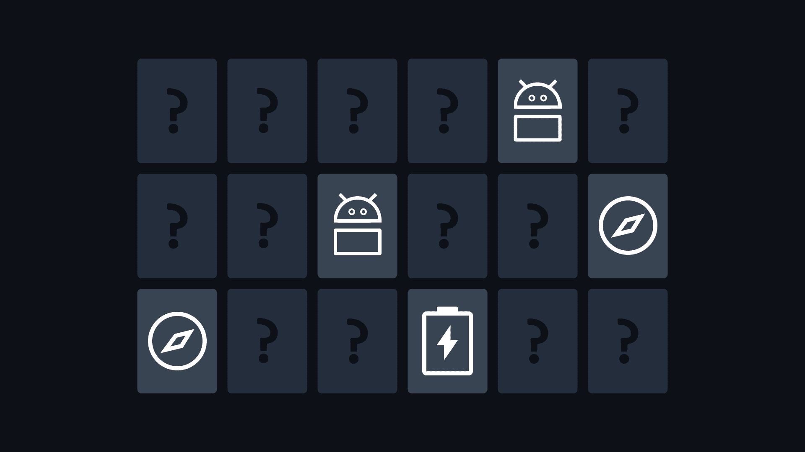

# Memory

<p align="center"></p>

**Memory** is a puzzle that's great for practicing memorization. You are given a field with a random set of elements, and each element in the field occur several times (usually 2 or 3). You have some time to remember the position of all the elements on the field, and then all of them are hidden and your task is to open pairs of identical elements one by one trying to make as few mistakes as possible.

## Generating a random grid

```nginx
GET https://shadify.yurace.pro/api/memory/generator
```

| Parameter        | Description                                                                                                                                                                                                                |
| ---------------- | -------------------------------------------------------------------------------------------------------------------------------------------------------------------------------------------------------------------------- |
| `width`          | _Optional_ <br><br> A number corresponding to the width of the generated grid. The total number of cells in the grid must not exceed 52 multiplied by the `pair-size`. <br><br> The default value is 6.                    |
| `height`         | _Optional_ <br><br> A number corresponding to the height of the generated grid. The total number of cells in the grid must not exceed 52 multiplied by the `pair-size`. <br><br> The default value is 4.                   |
| `pair-size`      | _Optional_ <br><br> A number corresponding to the size of a pair of identical elements. The value must be a multiple of the total number of cells in the grid. Available values: 2, 3, 4. <br><br> The default value is 3. |
| `show-positions` | _Optional_ <br><br> A true/false value that determines whether to send position information for each pair of elements. <br><br> Default value is _true_.                                                                   |

Returned response:

```json
{
    "width": 6,
    "height": 4,
    "pairSize": 3,
    "totalPairs": 8,
    "grid": [
        ["e", "g", "f", "a", "h", "d"],
        ["c", "d", "e", "d", "g", "a"],
        ["c", "h", "e", "b", "c", "b"],
        ["f", "a", "b", "h", "f", "g"]
    ],
    "pairPositions": [
        {
            "value": "a",
            "positions": [
                [1, 4],
                [2, 6],
                [4, 2]
            ]
        },
        {
            "value": "b",
            "positions": [
                [3, 4],
                [3, 6],
                [4, 3]
            ]
        },
        {
            "value": "c",
            "positions": [
                [2, 1],
                [3, 1],
                [3, 5]
            ]
        },
        {
            "value": "d",
            "positions": [
                [1, 6],
                [2, 2],
                [2, 4]
            ]
        },
        {
            "value": "e",
            "positions": [
                [1, 1],
                [2, 3],
                [3, 3]
            ]
        },
        {
            "value": "f",
            "positions": [
                [1, 3],
                [4, 1],
                [4, 5]
            ]
        },
        {
            "value": "g",
            "positions": [
                [1, 2],
                [2, 5],
                [4, 6]
            ]
        },
        {
            "value": "h",
            "positions": [
                [1, 5],
                [3, 2],
                [4, 4]
            ]
        }
    ]
}
```

> All elements of the `grid` are the usual letters of the English alphabet. The letters go first in lower case and then in upper case. The pool of letters is consumed in alphabetical order depending on the number of elements needed. Therefore, you can easily create your own map of correspondences, where each letter corresponds to a certain image, for example.
