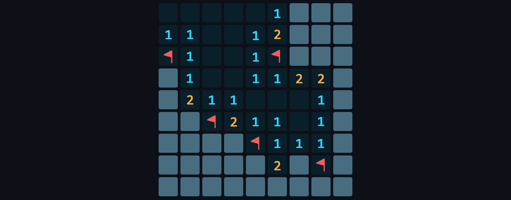

# Minesweeper

<p align="center"></p>

[Minesweeper](<https://en.wikipedia.org/wiki/Minesweeper_(video_game)>) – a computer puzzle game in which the playing field is divided into adjacent cells, some of which are mined. The number of mined cells is known. The goal of the game is to open all the cells that do not contain mines. This game has become quite popular among Windows users, since it was pre-installed by default on older versions of that OS.

## Generating a random field

```nginx
GET https://shadify.yurace.pro/api/minesweeper/generator
```

| Parameter | Description                                                                                                                                                                                                                                                                                                                                                           |
| --------- | --------------------------------------------------------------------------------------------------------------------------------------------------------------------------------------------------------------------------------------------------------------------------------------------------------------------------------------------------------------------- |
| `start`   | _Required_ <br><br> A string of the form _1-2_, which sets the starting position of the player. There will never be mines in and around this position. The first number is the X coordinate (from 1 to the value of the `widht` parameter), the second number is the Y coordinate (from 1 to the value of the `height` parameter) <br><br> There is no default value. |
| `width`   | _Optional_ <br><br> The number that sets the width of the generated field. The total number of cells in the field must not exceed 1000. <br><br> The default value is 9.                                                                                                                                                                                              |
| `height`  | _Optional_ <br><br> The number that sets the height of the generated field. The total number of cells in the field must not exceed 1000. <br><br> The default value is 9.                                                                                                                                                                                             |
| `mines`   | _Optional_ <br><br> The number that sets the number of mines on the field. The number of mines must not exceed 25% of the total number of cells on the field. <br><br> The default value is 12.                                                                                                                                                                       |

Returned response:

```json
{
    "start": "3-5",
    "width": 9,
    "height": 9,
    "board": [
        ["o", "o", "1", "x", "3", "x", "2", "x", "2"],
        ["1", "1", "1", "2", "x", "2", "2", "2", "x"],
        ["x", "1", "o", "1", "1", "1", "o", "1", "1"],
        ["1", "1", "o", "o", "o", "o", "o", "o", "o"],
        ["o", "o", "o", "1", "1", "1", "o", "o", "o"],
        ["2", "2", "1", "1", "x", "1", "o", "o", "o"],
        ["x", "x", "2", "2", "1", "1", "o", "1", "1"],
        ["x", "4", "x", "1", "o", "o", "o", "1", "x"],
        ["1", "2", "1", "1", "o", "o", "o", "1", "1"]
    ],
    "mines": 12
}
```
