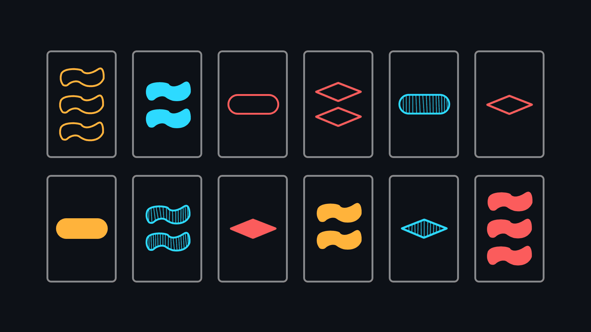

# Set

<p align="center"></p>

[**Set** (card game)](<https://en.wikipedia.org/wiki/Set_(card_game)>) – a fascinating card game. The game deck consists of 81 cards, each with one, two, or three of the same symbol (rhombus, oval, or wave) of the same color (red, green, or purple) and texture (shaded, shaded, or outline only). The essence of the game is to find a set - a set of three cards that meets certain conditions.

To understand the rules, read Wikipedia or watch [this interesting video](https://youtu.be/NzXDfSFQ1c0).

## Get all cards

```nginx
GET https://shadify.yurace.pro/api/set/start
```

Always returns the same array of 81 objects. Each object corresponds to one of the cards. An example of a card:

```json
{
    "_id": 0,
    "number": 1,
    "shape": "diamond",
    "color": "red",
    "shading": "solid"
}
```

> -   `_id` - a unique identifier for each card <br>
> -   `number` – number of figures: _1_ / _2_ / _3_ <br>
> -   `shape` – body shape: _diamond_ / _squiggle_ / _oval_ <br>
> -   `color` – figure color: _red_ / _green_ / _purple_ <br>
> -   `shading` – figure shading: _solid_ / _striped_ / _open_

## Generating a new game

```nginx
GET https://shadify.yurace.pro/api/set/start
```

| Parameter       | Description                                                                                                                                                                                                                                                                               |
| --------------- | ----------------------------------------------------------------------------------------------------------------------------------------------------------------------------------------------------------------------------------------------------------------------------------------- |
| `possible-sets` | _Optional_ <br><br> A true/false string that enables/disables the search for possible sets in the current `layout`. The list of possible sets is not necessary for the game and acts only as a hint and evidence that sets exist in the current `layout`. <br><br> Default value is true. |

Returned response:

```json
{
	"freeCards": [<69 cards>],
	"layout": [<12 cards>],
	"possibleSets": [[<3 cards>]],
	"wonCards": [],
	"state": "20-4-11-10-12-46-70-62-41-23-3-8"
}
```

> -   `freeCards` – an array of objects corresponding to free cards that have not yet been used in the game. <br>
> -   `layout` – an array of objects corresponding to the card that are available to play, i.e. to search for sets. <br>
> -   `possibleSets` – array containing arrays that include exactly 3 objects each. Each 3 object corresponds to a combination of three cards forming a set, which can be assembled from the cards available on the current `layout`. <br>
> -   `wonCards` – an array of objects corresponding to the won cards, which will no longer participate in the game. <br>
> -   `state` – a unique identifier for the current game state. It is needed to perform actions on deleting sets, adding additional cards or just to load the current game state. It has the following form _1-2-3@4-5-6_, where the numbers to the left of the sign _@_ correspond to the unique identifiers of those cards that are in `layout`, and the numbers on the right are in `wonCards`.

## Load state

```nginx
GET https://shadify.yurace.pro/api/set/<:state>
```

| Parameter       | Description                                                                                                                                                                                                                                                                                                                                                                                                                                                                                         |
| --------------- | --------------------------------------------------------------------------------------------------------------------------------------------------------------------------------------------------------------------------------------------------------------------------------------------------------------------------------------------------------------------------------------------------------------------------------------------------------------------------------------------------- |
| `possible-sets` | _Optional_ <br><br> A _true_/_false_ string that enables/disables the search for possible sets in the current `layout`. <br><br> Default value is true.                                                                                                                                                                                                                                                                                                                                             |
| `action`        | _Optional_ <br><br> The _add_/_remove_ string, which allows you to perform the appropriate action with the current game state. <br><br> The _add_ string adds 3 random cards from the current `freeCards` array to the current `layout` (available only if the `layout` size does not exceed 20 cards). <br><br> The _remove_ string removes the specified combination of three cards from the current `layout`. To do this you must use the `cards` parameter. <br><br> There is no default value. |
| `cards`         | _Required for `action=remove`_ <br><br> A string of the form _1-2-3_, where each number corresponds to the unique identifier of one of the cards that make up the set. <br><br> There is no default value.                                                                                                                                                                                                                                                                                          |

Examples of requests with state loading:

```nginx
https://shadify.yurace.pro/api/set/0-27-53-10-46-15-16-64-32-23-29-6?possible-sets=false
```

```nginx
https://shadify.yurace.pro/api/set/41-47-7-53-13-46-25-36-72-60-15-80?action=add
```

```nginx
https://shadify.yurace.pro/api/set/0-27-53-10-46-15-16-64-32-23-29-6?action=remove&cards=0-16-23
```
