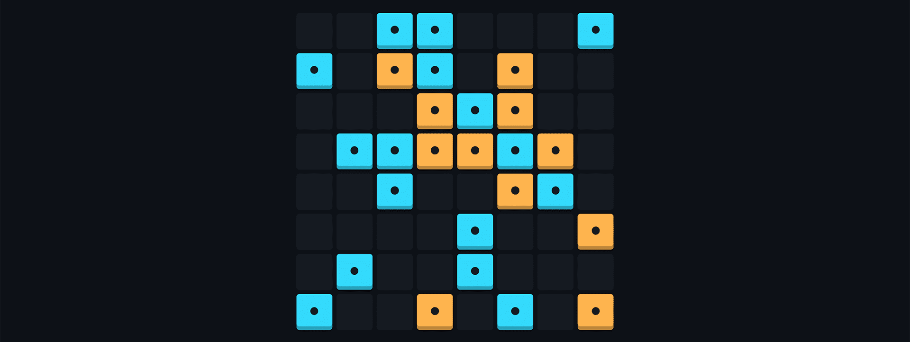

# Takuzu

<p align="center"></p>

[**Takuzu**](https://en.wikipedia.org/wiki/Takuzu) (a.k.a. Binairo) is an entertaining puzzle game with simple rules. All you have to do is to fill a square field of a certain size with two digits (or colors) while following three simple rules:

1. Each column and each row must be unique.
2. Each row and each column must have an equal number of tiles of each digit.
3. no more than two tiles with the same digit in a row (110001 is wrong, 110010 is right).

For an example, you can see my app [Binario](https://binario.vercel.app).

## Generating Takuzu

```nginx
GET https://shadify.yurace.pro/api/takuzu/generator
```

| Parameter | Description                                                                                                                              |
| --------- | ---------------------------------------------------------------------------------------------------------------------------------------- |
| `size`    | _Optional_ <br><br> An even number from 4 to 12, which specifies the size of the field. <br><br> The default value is 8.                 |
| `fill`    | _Optional_ <br><br> A number from 0 to 100 that corresponds to the field fill level (as a percentage). <br><br> The default value is 33. |

Returned response:

```json
{
    "size": 8,
    "field": [
        ["1", "1", "0", "0", "1", "1", "0", "0"],
        ["1", "1", "0", "1", "0", "0", "1", "0"],
        ["0", "0", "1", "0", "1", "1", "0", "1"],
        ["0", "1", "1", "0", "0", "1", "1", "0"],
        ["1", "0", "0", "1", "1", "0", "0", "1"],
        ["0", "0", "1", "1", "0", "0", "1", "1"],
        ["0", "1", "1", "0", "1", "1", "0", "0"],
        ["1", "0", "0", "1", "0", "0", "1", "1"]
    ],
    "task": [
        ["1", "1", "0", "0", "x", "x", "0", "0"],
        ["x", "1", "0", "x", "0", "x", "x", "x"],
        ["x", "x", "1", "x", "x", "x", "x", "x"],
        ["x", "1", "1", "x", "x", "x", "1", "0"],
        ["x", "x", "x", "x", "x", "x", "x", "1"],
        ["0", "x", "x", "x", "x", "x", "x", "1"],
        ["x", "x", "x", "x", "x", "1", "0", "x"],
        ["x", "x", "x", "x", "x", "x", "1", "1"]
    ]
}
```

## Checking Takuzu

To check Takuzu, you can use a GET-request with the required query parameter:

```nginx
GET https://shadify.yurace.pro/api/takuzu/verifier
```

| Parameter | Description                                                                                                                                                                                                                                               |
| --------- | --------------------------------------------------------------------------------------------------------------------------------------------------------------------------------------------------------------------------------------------------------- |
| `task`    | _Required_ <br><br> A string of the form `1010-1100-0011-0101`, which corresponds to the Takuzu field, where each line (row) is separated by a dash. It can only contain 0 and 1, the number of rows must be equal to the number of elements in each row. |

An example of a GET-request:

```nginx
https://shadify.yurace.pro/api/takuzu/verifier?task=1010-1100-0101-0101
```

Also, for convenience, you can use POST-request with body in JSON format

```nginx
POST https://shadify.yurace.pro/api/takuzu/verifier
```

Example body for a POST-request:

```json
{
    "task": [
        ["1", "0", "1", "0"],
        ["1", "1", "0", "0"],
        ["0", "0", "1", "1"],
        ["0", "1", "0", "1"]
    ]
}
```

Returned response:

```json
{
    "isValid": false,
    "message": "duplication",
    "position": ["row-3", "row-4"]
}
```
