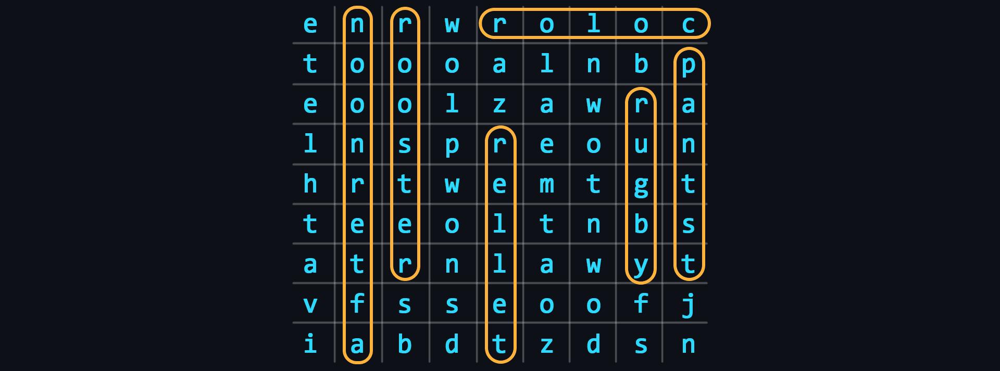

# Wordsearch

<p align="center"></p>

[**Word search**](https://en.wikipedia.org/wiki/Word_search) is a puzzle consisting of letters of words placed in a square or rectangular grid. The aim of the puzzle is to find and mark all the words hidden in the grid. The words can be placed horizontally, vertically or diagonally.

## Generating a random grid

```nginx
GET https://shadify.yurace.pro/api/wordsearch/generator
```

| Parameter | Description                                                                                                                                                                  |
| --------- | ---------------------------------------------------------------------------------------------------------------------------------------------------------------------------- |
| `width`   | _Optional_ <br><br> A number from 5 to 20 that specifies the width of the grid. The total number of cells in the field must not exceed 256. <br><br> The default value is 9. |
| `height`  | _Optional_ <br><br> A number from 5 to 20 that specifies the width of the grid. The total number of cells in the field must not exceed 256. <br><br> The default value is 9. |

Returned response:

```json
{
    "width": 9,
    "height": 9,
    "wordsCount": 10,
    "grid": [
        ["e", "n", "r", "w", "r", "o", "l", "o", "c"],
        ["t", "o", "o", "o", "a", "l", "n", "b", "p"],
        ["e", "o", "o", "l", "z", "a", "w", "r", "a"],
        ["l", "n", "s", "p", "r", "e", "o", "u", "n"],
        ["h", "r", "t", "w", "e", "m", "t", "g", "t"],
        ["t", "e", "e", "o", "l", "t", "n", "b", "s"],
        ["a", "t", "r", "n", "l", "a", "w", "y", "t"],
        ["v", "f", "s", "s", "e", "o", "o", "f", "j"],
        ["i", "a", "b", "d", "t", "z", "d", "s", "n"]
    ],
    "words": [
        { "word": "color", "position": { "start": [9, 1], "end": [5, 1] } },
        { "word": "downtown", "position": { "start": [7, 9], "end": [7, 2] } },
        { "word": "teller", "position": { "start": [5, 9], "end": [5, 4] } },
        { "word": "pants", "position": { "start": [9, 2], "end": [9, 6] } },
        { "word": "athlete", "position": { "start": [1, 7], "end": [1, 1] } },
        { "word": "afternoon", "position": { "start": [2, 9], "end": [2, 1] } },
        { "word": "snowplow", "position": { "start": [4, 8], "end": [4, 1] } },
        { "word": "rooster", "position": { "start": [3, 1], "end": [3, 7] } },
        { "word": "rugby", "position": { "start": [8, 3], "end": [8, 7] } },
        { "word": "oatmeal", "position": { "start": [6, 8], "end": [6, 2] } }
    ]
}
```
